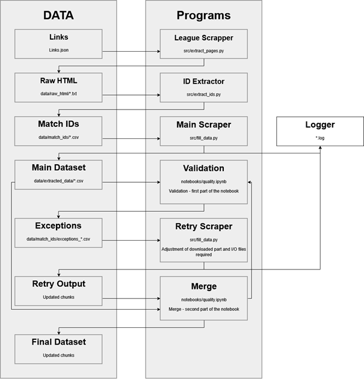

# ⚽ Football Match Outcome Prediction System

A comprehensive machine learning system for predicting football match outcomes (Win/Draw/Loss) using historical match data, betting odds, and advanced feature engineering.

## 📊 Project Overview

This project implements an **ELT (Extract-Load-Transform)** pipeline and machine learning framework for football match prediction, leveraging:
- **Web-scraped match data** from Flashscore.pl (~14,000 matches)
- **Historical betting odds** for market analysis
- **Statistical features** from match events and player ratings
- **Decision Tree & Random Forest** classifiers with confidence-based betting strategies
The system processes data from **12 European leagues** spanning **4 seasons (2020-2024)**.

## 🎯 Key Features
 
### Data Pipeline (ELT Architecture)
- ✅ **Web Scraper**: Custom BeautifulSoup scraper for Flashscore.pl
- ✅ **Extract**: League pages → Match IDs → Full match statistics
- ✅ **Load**: Raw HTML storage before processing
- ✅ **Transform**: Multi-stage data cleaning and feature engineering
- ✅ **Validation**: Quality checks and exception handling with retry logic
### Modeling Approach
- ✅ **Baseline models**: Decision Trees, Random Forests
- ✅ **Confidence-based betting**: Only bet when model confidence exceeds threshold
- ✅ **Cross-validation**: 5-fold stratified CV for robust evaluation
- ✅ **Profit-based scoring**: Custom scorer optimizing ROI vs. bookmaker odds
### Performance Metrics
- **Accuracy**: Model prediction correctness
- **Betting profit**: ROI after accounting for losses
- **Coverage**: Percentage of matches where model places bets
- **Confidence calibration**: Model certainty vs. actual win rate
## 📁 Project Structure

```
football-prediction/
├── src/
│   ├── extract_pages.py        # League scraper (Flashscore.pl)
│   ├── extract_ids.py          # Match ID extractor
│   ├── fill_data.py            # Main scraper (match statistics)
│   └── links.json              # League URLs configuration
├── data/
│   ├── raw_html/               # Raw scraped HTML files
│   ├── match_ids/              # Extracted match IDs (CSV)
│   ├── extracted_data/         # Main dataset (CSV per season)
│   ├── transformed_data/       # Cleaned & engineered features (CSV)
│   └── processed/              # Time-series aggregates (JSON)
├── notebooks/
│   ├── analysis.ipynb          # EDA & modeling experiments
│   └── quality.ipynb           # Data validation & merge
├── models/
│   └── RF_classifier.pkl       # Trained Random Forest model
├── charts/                     # Betting strategy visualizations
└── README.md
```

**Main file (analysys) is in SRC folder**


## 🔬 Methodology
 
### 1. Data Collection (Web Scraping)
 
**Source**: Flashscore.pl (Polish football statistics portal)
 
**Scraping Pipeline**:



 
**Key Scripts**:
- `extract_pages.py`: Scrapes league standings/fixtures
- `extract_ids.py`: Parses match IDs from HTML
- `fill_data.py`: Fetches detailed match statistics + retry logic for failures
**Data Collected Per Match**:
- Match outcome (home win / draw / away win)
- Goals scored (home/away)
- Match events (shots, possession, fouls, cards, etc.)
- Player ratings (goalkeeper, defense, midfield, attack)
- Betting odds (1 / X / 2 / 1X / X2 / 12)
### 2. ELT Pipeline
 
**Extract**:
- Raw HTML files stored in `data/raw_html/`
- Preserves original structure for reprocessing
**Load**:
- Initial parsing to `data/extracted_data/` (CSV)
- Season-based files: `20_21_final.csv`, `21_22_final.csv`, etc.
**Transform**:
- Data cleaning (missing values, outliers)
- Feature engineering (positional ratings, cumulative stats)
- League one-hot encoding
- Output: `data/transformed_data/*.csv`
**Validation**:
- `quality.ipynb`: Merges chunks, validates integrity
- Exception tracking: `data/match_ids/exceptions_*.csv`
- Retry scraper: Re-fetches failed matches
### 3. Feature Engineering
 
**Engineered Features**:
- **Positional Ratings**: Aggregated GK/DEF/MID/ATT ratings from player data
- **Cumulative Stats**: Points, wins, draws, losses (season-to-date)
- **Match Context**: Home/away, match number, league
- **Betting Market**: Odds for all outcome types
**Planned (Time-Series)**:
- Rolling averages: `avg3_attacks`, `avg5_possession`
- Form indicators: `last3_points`, `last5_gd`
### 4. Modeling
 
**Decision Tree Classifier**:
Used as benhmark and lerning purpose part about feature importance and selection.
```python
BettingTreeClassifier(
    max_depth=4,
    min_samples_leaf=200,
    features=match_statistics  # excludes betting odds
)
```
**Confidence Threshold Strategy**:
- Only bet when `P(outcome) > threshold`
- Threshold grid search: 0.33 → 0.95 (step 0.02)
- Optimal balance: coverage vs. accuracy
### 5. Evaluation
 
Custom profit-based scorer:
```python
profit = Σ [(odds - 1) if correct else -1]
```
 
**Benchmark**: Beat bookmaker's implied probabilities (market efficiency test)
 
## 📈 Results Snapshot

|Confidence |    CV profit |   Placed |    % Bet |   Accuracy|
|------------|-------------|-----------|---------|----------|
|0.49 |18.31 |1897 |18.2% |66.7%|
|0.51 |16.12 |1278 |12.2% |69.3%|
|0.53 |4.07 |895 |8.6% |71.6%|
|0.55 |6.57 |639 |6.1% |73.7%|
 
*Positive profit = Beating bookmaker odds after accounting for losses -without taxes-*
 
## 🗺️ Project Roadmap
 
### Phase 1: Data Extraction ✅ Complete
- [x] **Web Scraper**: BeautifulSoup-based scraper for Flashscore.pl
- [x] **League Scraper**: Extract league pages and match links
- [x] **ID Extraction**: Parse match IDs from HTML
- [x] **Main Scraper**: Fetch detailed match statistics
- [x] **Logger**: Track scraping progress and errors
- [x] **Retry Logic**: Handle failures and exceptions
- [x] **Data Storage**: Raw HTML files (ELT approach)
### Phase 2: Data Validation & Merging ✅ Complete
- [x] **Quality Notebook**: Data integrity validation
- [x] **Exception Handling**: Identify and re-scrape failed matches
- [x] **Chunk Merging**: Combine scraped batches into season datasets
- [x] **Final Datasets**: 4 seasons × CSV files (20_21 → 23_24)
### Phase 3: Exploratory Data Analysis ✅ Complete
- [x] **Statistical Analysis**: Distribution exploration, outlier detection
- [x] **Visualization**: Match outcome patterns, league characteristics
- [x] **Betting Odds Analysis**: Market efficiency investigation
- [x] **Feature Correlation**: Identify predictive variables
- [x] **Temporal Patterns**: Home advantage, season trends
### Phase 4: Data Transformation ✅ Complete
- [x] **Data Cleaning**: Missing values, duplicates, type conversions
- [x] **Feature Engineering**: Positional ratings, cumulative stats
- [x] **League Encoding**: One-hot encoding for 12 leagues
- [x] **Transformed Datasets**: Output to `data/transformed_data/`
- [x] **Time-Series Structure**: JSON files with match history per team
### Phase 5: Baseline Modeling ✅ Complete
- [x] **Decision Tree**: Depth-4 classifier (baseline)
- [x] **Custom Scorer**: Profit-based evaluation function
- [x] **Confidence Thresholding**: Selective betting strategy
- [x] **Cross-Validation**: 5-fold stratified CV
- [x] **Threshold Optimization**: Grid search 0.33-0.95
### Phase 6: Advanced Modeling 🔄 In Progress
- [x] **Random Forest**: Model for final optimalization
- [ ] **XGBoost**: Gradient boosting implementation (optional)
- [ ] **Model Comparison**: Benchmark across algorithms
- [ ] **Hyperparameter Tuning**: GridSearchCV for optimal params
### Phase 7: Time-Series Integration 🔜/🔄 Planned
- [x] **Data Structure**: Historical match sequences (JSON)
- [ ] **Rolling Averages**: avg3/avg5/avg10 for match stats
- [ ] **Form Indicators**: last3/last5/last10 for results
- [ ] **Feature Integration**: Add to training pipeline
- [ ] **Home/Away Deltas**: Difference features (home - away)
### Phase 8: Betting Simulation 🔜 Planned
- [ ] **Historical Backtest**: Apply model to past seasons
- [ ] **Bankroll Management**: Fixed stake vs. Kelly Criterion
- [ ] **Profit Curves**: Cumulative returns over time
- [ ] **Drawdown Analysis**: Risk assessment
- [ ] **Strategy Comparison**: Bet all vs. selective betting
### Phase 9: Production & Documentation 🔜 Planned
- [ ] **Code Refactoring**: Modularize scripts, clean notebooks
- [ ] **Documentation**: Docstrings, README updates
- [ ] **Reproducibility**: Requirements.txt, environment setup
- [ ] **Deployment**: Model serving (optional)
## 🛠️ Tech Stack
 
- **Python 3.10+**
- **Web Scraping**: BeautifulSoup4, requests
- **Data Processing**: pandas, numpy
- **Machine Learning**: scikit-learn
- **Visualization**: matplotlib, seaborn
- **Serialization**: pickle (model storage)
## 📊 Data Source
 
**Primary Source**: [Flashscore.pl](https://www.flashscore.pl)
- Polish sports statistics portal
- Comprehensive match-level data
- Historical betting odds
**Leagues Covered** (12 total):
- Premier League (England)
- La Liga (Spain)
- Serie A (Italy)
- Bundesliga (Germany)
- Ligue 1 (France)
- Eredivisie (Netherlands)
- Primeira Liga (Portugal)
- Ekstraklasa (Poland)
- Jupiler League (Belgium)
- Tipico Bundesliga (Austria)
- Premier Liga (Russia)
- Super League (Greece)
**Seasons**: 2020/21, 2021/22, 2022/23, 2023/24
 
## 📖 Key Insights
 
1. **Market Efficiency**: Betting odds remain the strongest single predictor, confirming semi-strong market efficiency
3. **Confidence Calibration**: Models are well-calibrated — predicted probabilities align with actual outcomes
4. **Selective Betting**: Betting only high-confidence predictions (10-30% coverage) yields positive ROI vs. betting all matches
5. **Cross-Validation Stability**: Moderate variance between folds suggests model generalizes reasonably well
6. **Home Advantage**: Consistent across leagues (~45% home win rate) but varies by competition level
## 🚀 Installation & Usage
 
### Requirements
```bash
pip install pandas numpy scikit-learn matplotlib seaborn beautifulsoup4 requests
```
 
## 🎓 Academic Context
 
This project was developed as part of a **Master's thesis** investigating:
- Machine learning applications in sports analytics
- Market efficiency hypothesis in football betting markets
- Predictive modeling with imbalanced outcomes (home/draw/away)
- Feature engineering for match-level sports data

 
## ⚠️ Scraping Ethics & Legal
 
This project scraped publicly available data from Flashscore.pl for **educational and research purposes only**. 
- Data is used solely for academic analysis (Master's thesis)
- No commercial use or redistribution of scraped data
## 📄 License
 
This project is for **educational and research purposes only**.
  
---
 
**⚠️ Disclaimer**: This project is for educational purposes only. Sports betting involves financial risk. Past performance does not guarantee future results. Always bet responsibly.
